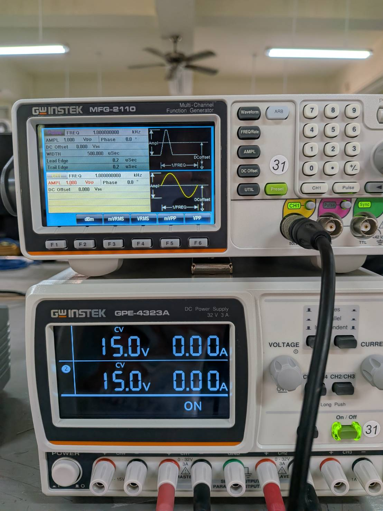
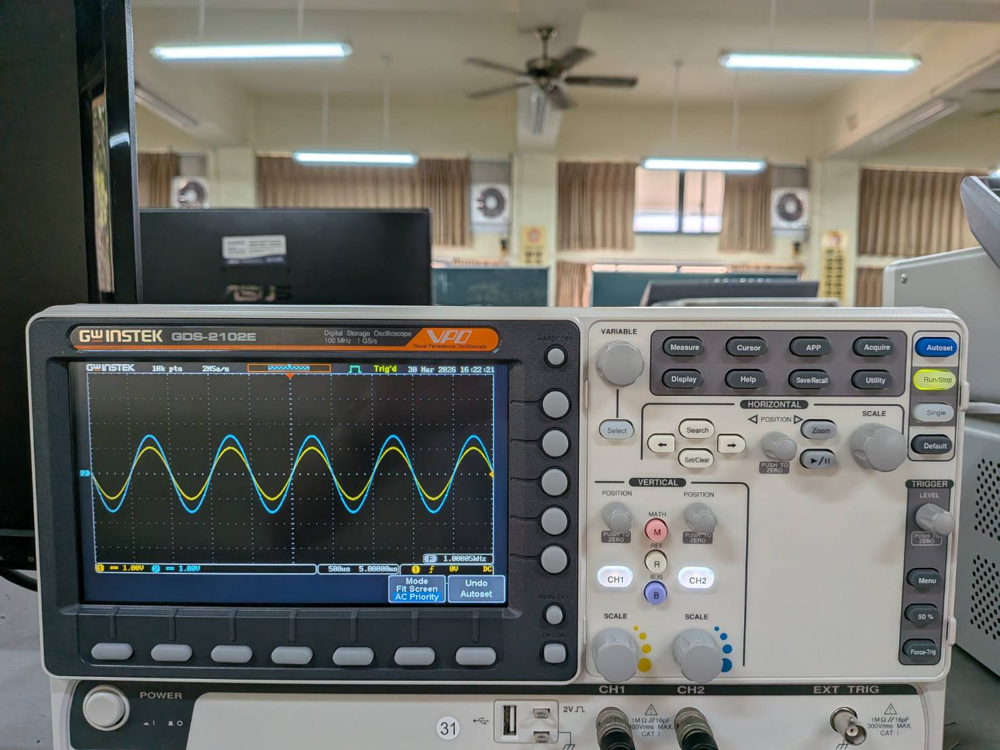
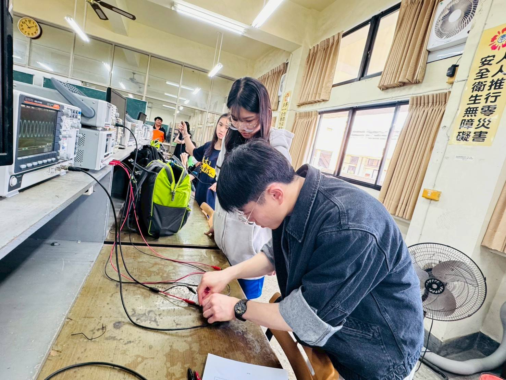
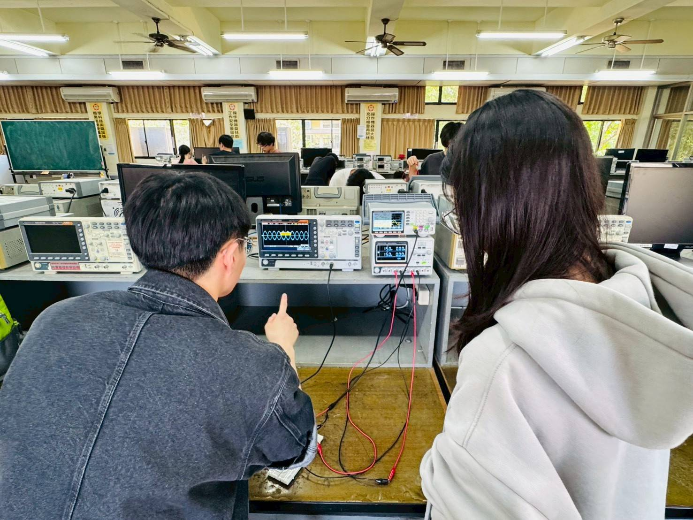

# Intern Teacher at NCKU-ATIHS 
### Dept. of Information and Electronic Engineering
- #### Hardware Instrumentation & Debugging
  - Proficient in Oscilloscopes, DMMs, and Signal Generators.
  - Expert in OPA, MOS, BJT, and Digital Logic breadboard assemblies with a focus on systematic troubleshooting.
- #### Circuit Simulation App
  - Developed a high-performance Flutter PWA (Wasm/Skia) that simulates real-time circuit behavior.
  - Features advanced web architecture including CI/CD-integrated Cache Busting and Asynchronous Service Worker monitoring to enhance interactive instructional demonstrations.

## OUTLINE
- [教案設計](#教案設計)
- [教具製作](#教具製作)
- [簡報設計](#簡報設計)
- [學習單設計](#學習單設計)
- [實作電路](#實作電路)

## 一、電子電路實作 與 儀器量測

  
  
  

  
  
  
  

### 二、數位教具製作 [GitHub](https://github.com/PlusRon/Flutter_app-Electronics_laboratory_project.git)
  - #### 電子學電路模擬應用程式 [網站 App](https://flutter-app-electronics-lab.web.app/)
    

      
      
    

### [簡報設計](簡報)

### [教案設計](教學計劃_教案設計) 

### [學習單設計](課程學習單)

