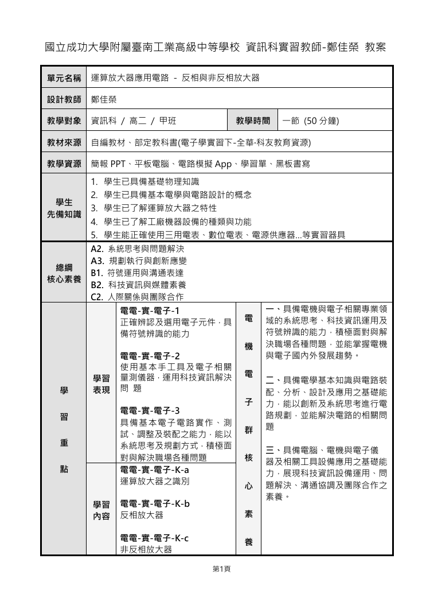
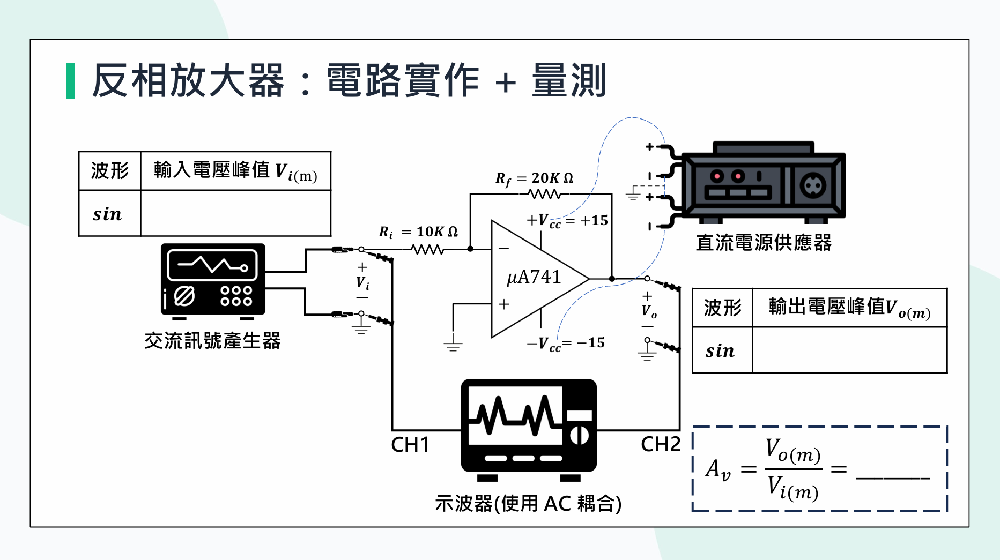
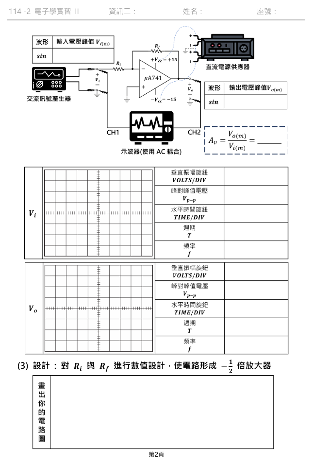
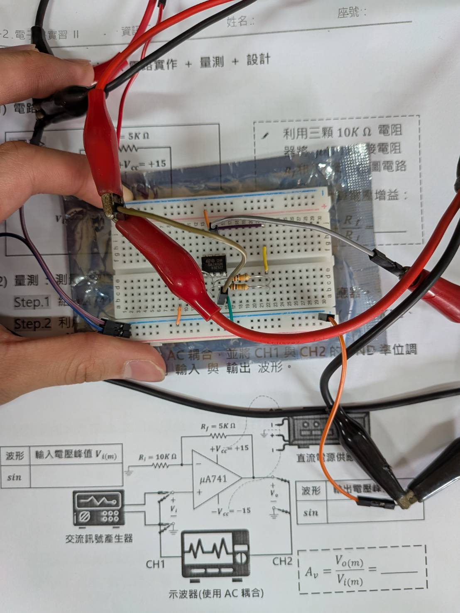
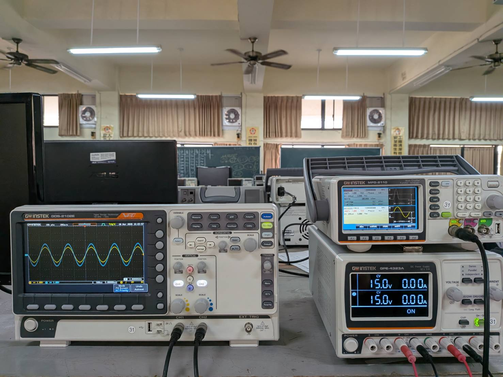

# OPA 數位教具開發與實務量測課程整合專案
本活動整合資訊開發與技職教育專長，利用 Flutter 打造跨平台互動電路模擬 App，引導學生透過平板進行數位探索，並結合 **OPA 反相與非反相放大器** 實習課程教案，帶領學生從軟體模擬平滑銜接至實體電路量測—，藉由操作示波器、訊號產生器等專業儀器與學習單，建構從虛擬模擬到硬體實踐的全方位學習路徑。

## Outline
- [教案設計](#教案設計)
- [教具製作](#教具製作)
- [簡報設計](#簡報設計)
- [學習單設計](#學習單設計)
- [實作電路](#實作電路)

### [教案設計](教學計劃_教案設計) 

### [教具製作](https://github.com/PlusRon/Flutter_app-Electronics_laboratory_project.git)
  - #### [電子學電路模擬 App](https://flutter-app-electronics-lab.web.app/)
    

### [簡報設計](簡報)

### [學習單設計](課程學習單)

### 實作電路

  
  

